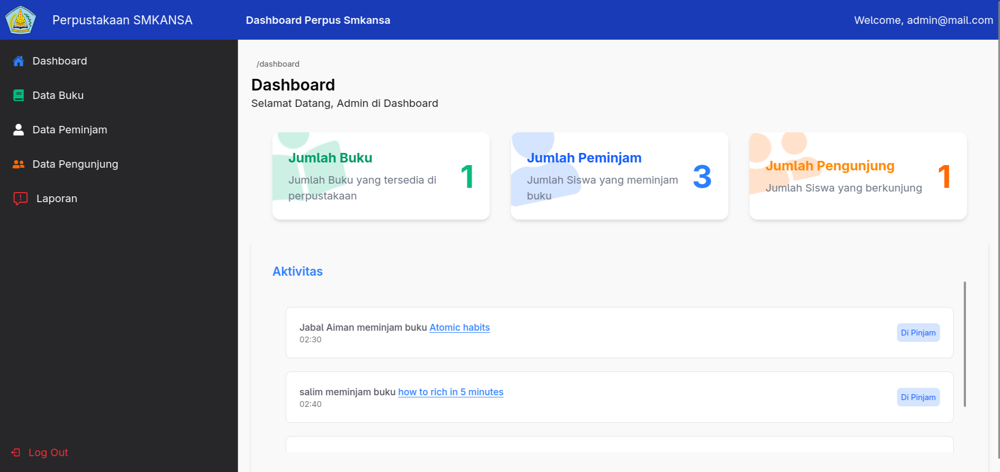
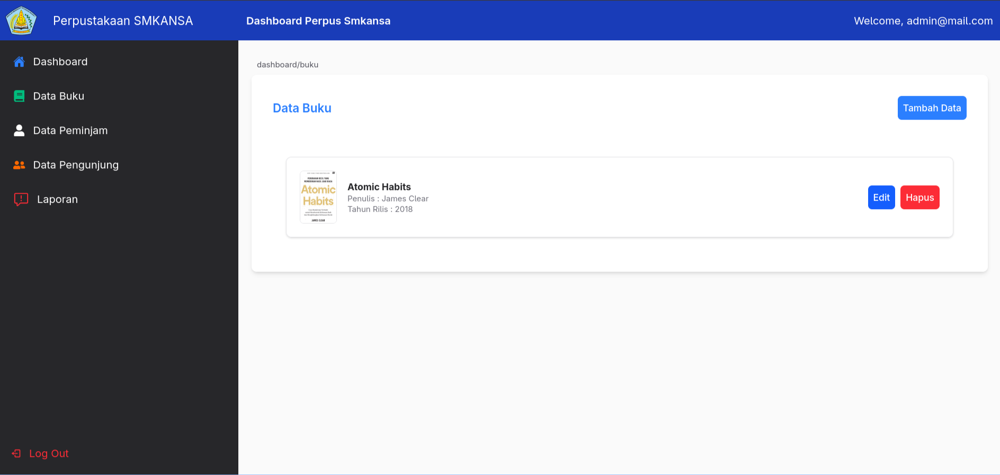
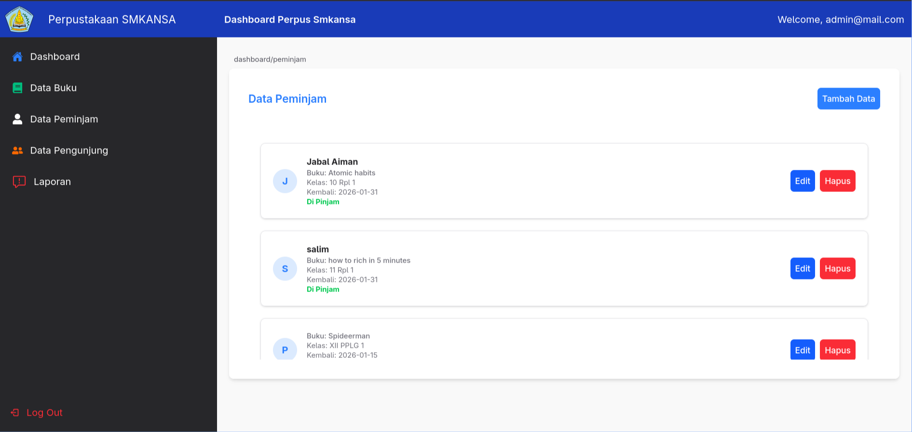

## 📚 Perpus-Smkansa

**Perpus-Smkansa** adalah aplikasi manajemen perpustakaan berbasis desktop (Neutralinojs) dan web yang dirancang untuk memudahkan proses administrasi di perpustakaan SMKN 1 Sumbawa. 

Aplikasi ini memudahkan petugas dalam mengelola data buku dan mencatat pengunjung

### Preview
<table border="0">
  <tr>
    <td></td>
    <td></td>
  </tr>
  <tr>
    <td></td>
    <td></td>
  </tr>
</table>

### Demo
<a href="https://perpus-smkansa.vercel.app/">https://perpus-smkansa.vercel.app</a>

### Fitur Utama
* **Manajemen Buku:** Input, edit, dan hapus koleksi buku dengan mudah.
* **Absensi Pengunjung:** Pencatatan otomatis siswa yang berkunjung ke perpustakaan.
* **Peminjaman Digital:** Pantau status peminjaman (dipinjam/kembali) secara transparan.
* **Database Cloud:** Menggunakan Supabase untuk sinkronisasi data yang aman dan cepat.
* **Desktop Ready:** Aplikasi ringan yang bisa dijalankan langsung di Windows atau Linux tanpa perlu browser manual.

### Tech Stack


### Cara Menjalankan Project
1.  **Clone repository ini:**
    ```bash
    git clone https://github.com/Programmer-SMKANSA/perpus-smkansa.git
    ```
2.  **Install dependencies:**
    ```bash
    npm install
    ```
3.  **Build React App:**
    ```bash
    npm run build
    ```
4.  **Jalankan aplikasi (Mode Desktop):**
    ```bash
    neu run
    ```

### Setup Database
<a href="https://github.com/Programmer-SMKANSA/perpus-smkansa/blob/main/skema_db.txt">Klik disini!</a>
<br/>
note : wajib buat akun admin untuk login ke dashboard, pergi ke db lalu bagian authentication add user lalu masukan email dan password
